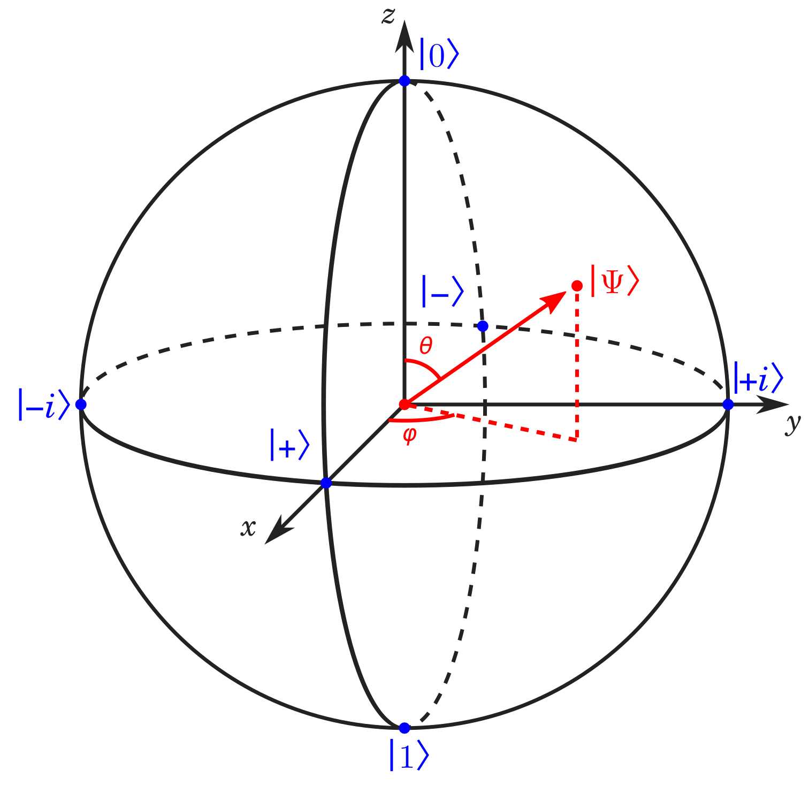

# Quantum Gate Game
A simple game to help those learning quantum computing to reinforce how quantum gates affect qubits. Quantum gates from the game [Qubit Touchdown](https://www.thegamecrafter.com/games/qubit-touchdown) are randomly supplied, and the player must apply these gates to a qubit following a Bloch Sphere (I recommend using a tennis ball).

This game does not teach how quantum gates work, it simply allows you to practice and cement an existing undertanding. 
kherb27's [Bloch Sphere Simulator](https://bloch.kherb.io/) is a great resource for learning how each gate changes the state of the qubit.

## How to launch
With Python, you can simply execute run.py. Example call from within the "py" folder- `python3 run.py` 

Those without Python experience can navigate to the "dist" folder and run the windows executable "qgate_game.exe"

## Game modes
There are currently two gamemode - Normal and Rapidfire.

In the Normal gamemode, a number of gates dictated by the settings are provided to the user one at a time. The user presses enter when they are done applying the gate. Each gate is expected to be applied in a set amount of time, also dictated by the settings. If a gate is paused on for longer than this amount of time, a point is deducted from the final score.

In the Rapidfire gamemode, the same number of gates are provided to the user, but the next gate will automatically appear after the set amount of time. The user must keep up to ensure their final state is correct.

## Gate definitions
- X - Pauli X Gate. Rotate 180° about the X axis.
- Y - Pauli Y gate. Rotate 180° about the Y axis.
- Z - Pauli Z gate. Rotate 180° about the Z axis.
- S - Phase gate. Rotate 90° about the Z axis.
- SX - Square root of X gate. Rotate 90° about the X axis.
- H - Hadamard gate. Rotate 180° about the X+Z axis.
- M - Measurement. If the current state is 0 or 1, do nothing. Otherwise, measure as 0*.
- I - Identity gate. Do nothing.

\* To ensure predictability in the final state, the measurement gate will always measure to 0 when faced with an uncertain measurement. Note that this is innacurate to the true behavior which would choose 0 or 1 with a 50% probability.

## Axis definitions
The Z axis is denoted as 0 (positive) and 1 (negative).

The X axis is denoted as + (positive) and - (negative).

The Y axis isi denoted as i (positive) and -i (negative).

